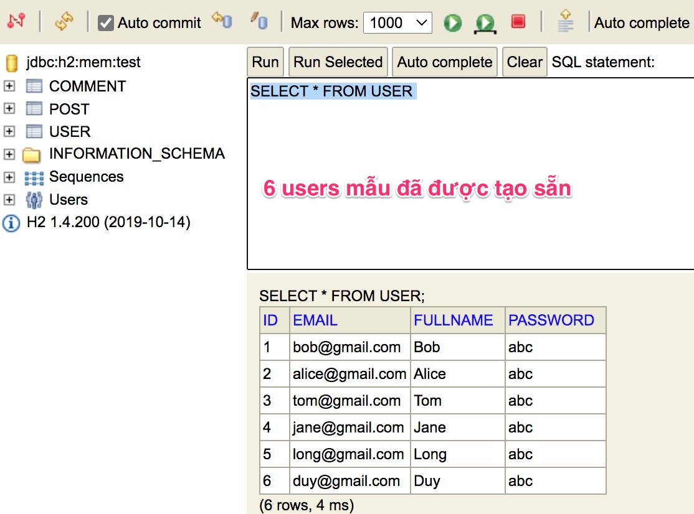

# Lập trình tại lớp 180 phút: ứng dụng Micro Blog

## Các kiến thức sử dụng
- Thiết kế blog cơ bản với mô hình MVC
- Sử dụng cookie để xác định user
- Render trang html bằng Thymeleaf
- Thao tác với cơ sở dữ liệu H2
- Quan hệ giữa các bảng: một-một, một-nhiều

## Các chức năng khi thao tác
- Login, logout user (danh sách user có sẵn)
- CRUD với post
- Create, delete comment

## Quan hệ giữa các bảng
- One user writes many posts
- One user writes many comments
- One post can receive many comments

## Dữ liệu mẫu có sẵn
6 users mẫu với password là 'abc' đã được nạp sẵn từ file [user.sql](src/main/resources/user.sql)
